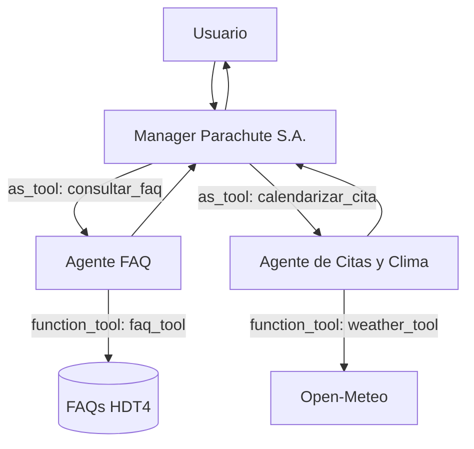

# Diagrama — Arquitectura centralizada

```mermaid
flowchart TD
    U[Usuario] --> M[Manager Parachute S.A.]
    M -->|as_tool: consultar_faq| F[Agente FAQ]
    F -->|function_tool: faq_tool| KB[(FAQs HDT4)]
    M -->|as_tool: calendarizar_cita| C[Agente de Citas y Clima]
    C -->|function_tool: weather_tool| OM[Open-Meteo]
    F --> M
    C --> M
    M --> U
```

El manager conserva el control de la conversación. Los workers no se
comunican directamente entre sí ni responden directamente al usuario.
