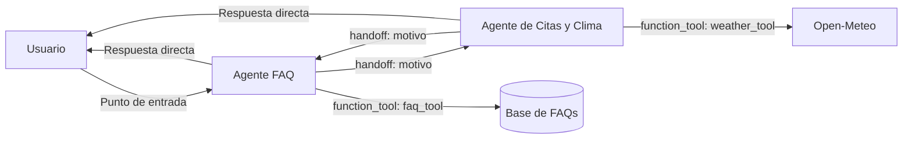

# Diagrama — Arquitectura descentralizada

## Funcionamiento

No existe un manager o supervisor central. El Agente FAQ es únicamente el
punto de entrada de la conversación:

1. El agente activo atiende las solicitudes de su especialidad.
2. Si detecta una solicitud del otro dominio, transfiere el control mediante
   un `handoff`.
3. El agente receptor obtiene el historial y responde directamente al usuario.
4. `resultado.last_agent` conserva al agente activo para el siguiente turno.

Los handoffs incluyen un campo `motivo` para generar un esquema JSON con
propiedades compatible con el endpoint de Groq. Esta información no cambia el
destino: FAQ transfiere a Citas y Clima, y Citas y Clima transfiere a FAQ.

La lógica de negocio permanece en `hdt5/shared/`: los agentes utilizan las
mismas herramientas compartidas que las arquitecturas centralizada y
jerárquica.
