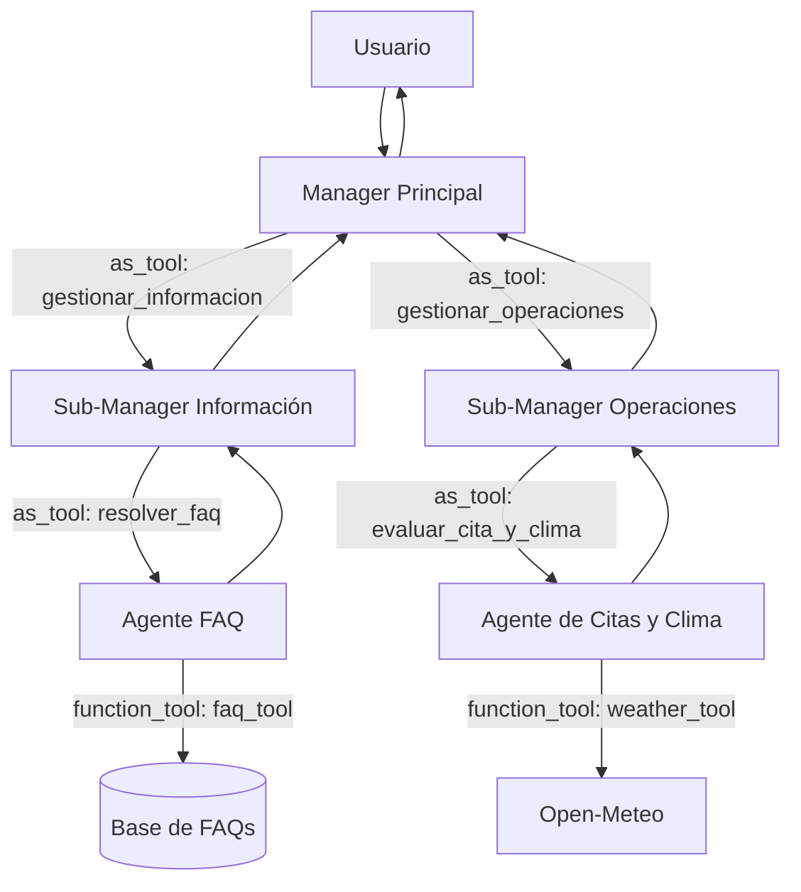

# Diagrama — Arquitectura jerárquica

## Funcionamiento

El manager principal es la única interfaz con el usuario y conserva el control
del turno. Clasifica la solicitud entre Información y Operaciones —o consulta
ambos dominios si el mensaje los combina— y llama al sub-manager apropiado con
`Agent.as_tool()`.

Cada sub-manager posee únicamente los workers de su dominio. Información
delega en el worker FAQ; Operaciones delega en el worker de Citas y Clima. Los
workers usan las mismas tools compartidas de `hdt5/shared/` que las otras dos
arquitecturas y sus resultados suben por la jerarquía hasta el manager
principal, que redacta la respuesta final.

Esta estructura añade un nivel de coordinación frente a la arquitectura
centralizada. Con los dos requisitos actuales puede parecer más amplia de lo
necesario, pero permite agregar futuros workers de información u operaciones
sin exponerlos ni modificar el enrutamiento del manager principal.
